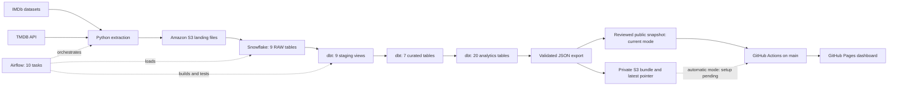

# Movie Analytics Pipeline

**Live Dashboard:** [Open the Movie Observatory](https://ishuapurva1996.github.io/movie-analytics-pipeline/)

[](https://ishuapurva1996.github.io/movie-analytics-pipeline/)

A movie data pipeline that combines IMDb datasets with TMDB now-playing information for the United States and India. Python extracts the source data, Amazon S3 stores the landing files, Snowflake holds the warehouse, and dbt builds the tables used for analysis. Apache Airflow schedules and coordinates the work.

**Current status:** the approved dashboard is live on GitHub Pages, with all nine charts, four KPIs, movie highlights, job-role and US/India selectors, and a light/dark toggle. The public site was verified on desktop and mobile on October 7, 2026. It uses the existing October 5 data snapshot with News titles excluded; data updates are manual initially. Automatic Airflow publication is implemented but still requires private integration setup and a verified complete ten-task run. See [dashboard operations](docs/DASHBOARD_OPERATIONS.md).

## What the pipeline supports

- Movie counts, ratings, runtimes, and genre summaries.
- Analyses by release year and decade, rating distributions, and ranked movies and people.
- Current now-playing counts and movie recommendations for the US and India.
- Weekly refreshes every Monday at **6:00 AM America/Los_Angeles**, with manual runs available in Airflow.
- Full replacement of all nine Snowflake RAW tables, followed by a full dbt rebuild.

TMDB details are fetched for the distinct movies in the current now-playing extract. They supplement the broader IMDb catalog; they are not a complete historical TMDB catalog.

## Architecture



The RAW layer holds six IMDb datasets and three TMDB datasets. Staging views normalize source fields. Curated tables join movie, genre, person, rating, and now-playing data. Analytics tables provide the final summaries and rankings.

The dashboard reads a bounded JSON export with aggregate metrics and ranked rows. Visitors need no Snowflake, AWS, or TMDB credentials. [Dashboard metrics](docs/DASHBOARD_METRICS.md) documents each population, threshold, ranking, and limitation.

## Refresh and failure behavior

Each RAW load first copies data into a temporary Snowflake table. After checking that the load is nonempty, the pipeline replaces that target table's rows in a transaction. An empty load leaves the target unchanged, and a failed insert rolls back its replacement. These transactions apply **per table**, not to the entire pipeline at once.

All tables use full refreshes, including `TMDB_NOW_PLAYING`. Its `SNAPSHOT_DATE` describes the incoming extract; previous snapshots are not retained. The dbt task runs `dbt build --full-refresh`, rebuilding 27 tables and recreating nine staging views.

TMDB movie-details requests have a 30-second timeout and retry temporary failures up to three attempts. If any movie still fails, enrichment raises an error before writing its output CSV. Airflow retries the task once after five minutes. The TMDB upload, TMDB load, and dbt build wait for enrichment to succeed; the independent IMDb branch can still run.

The live site currently publishes the reviewed export checked into `web_dashboard/snapshot/`. Relevant changes to `main` or a manual run of [Publish dashboard snapshot](https://github.com/ishuapurva1996/movie-analytics-pipeline/actions/workflows/deploy-dashboard-snapshot.yml) redeploy it. Data changes require replacing the real export and its checksum; redeploying alone does not refresh the warehouse.

The separate automatic route, once configured, runs after dbt succeeds: Airflow checks task history, validates the public data contract, writes an immutable private S3 bundle, and conditionally updates the latest-success pointer. A final task requests the GitHub deployment workflow. Successful dispatch means GitHub accepted the request; the Actions run and its public bundle check establish whether deployment succeeded. Failures before deployment preserve the last successful site. See [failure recovery](docs/DASHBOARD_OPERATIONS.md#failure-recovery).

## Run locally

Prerequisites:

- Docker with Docker Compose.
- A TMDB API Read Access Token.
- AWS credentials and an S3 bucket for the landing files.
- A Snowflake account with a warehouse, `MOVIE_DB.RAW` target tables, external stages, and file formats already configured for the source files.

The repository does **not** provision the AWS or Snowflake infrastructure. The DAG and dbt sources currently reference `MOVIE_DB.RAW`; check those definitions when adapting the project to a different database.

1. Copy [.env.example](.env.example) to `.env` and fill in your local settings.
2. Configure AWS credentials. Docker mounts `~/.aws` read-only; environment variables are also supported.
3. Follow [AIRFLOW_SETUP.md](AIRFLOW_SETUP.md) to build the image, initialize Airflow, start the services, and verify the Snowflake connection.
4. Configure the dashboard credentials and GitHub settings in [dashboard operations](docs/DASHBOARD_OPERATIONS.md).
5. Open [local Airflow](http://localhost:8080), unpause `movie_analytics_pipeline`, and trigger a manual run. Check that all ten tasks succeed. Review both dbt test results and the [Actions deployment run](https://github.com/ishuapurva1996/movie-analytics-pipeline/actions/workflows/deploy-dashboard.yml) before calling the dashboard updated.

The Compose configuration is for local development. It includes local Airflow login defaults documented in the setup guide.

## Tests

The Python regression suite covers extraction/enrichment, the DAG and Snowflake refresh logic, the dashboard contract and exporter, publication eligibility, and site assembly. These tests use mocked external services; passing them does not replace a complete Airflow run against your infrastructure.

Install the local dependencies in a virtual environment and run the ingestion and dashboard tests:

```bash
python3 -m venv movie_proj_venv
source movie_proj_venv/bin/activate
pip install -r requirements.txt
pip install -r requirements-dashboard.txt
python -m unittest discover -s tests -p 'test_pipeline_scripts.py' -v
python -m unittest discover -s tests -p 'test_dashboard_*.py' -v
```

Run the Airflow tests inside a running scheduler container. The test file is supplied through standard input because `tests/` is not mounted into the container:

```bash
docker compose exec -T -e PYTHONPATH=/opt/airflow/dags airflow-scheduler python - < tests/test_airflow_dag.py
```

The dbt project also defines data tests that run against Snowflake as part of the `dbt_build` task. See [the model definitions](movie_dbt/models/) for the transformations and associated checks.

The [validation workflow](.github/workflows/validate-dashboard.yml) also checks JavaScript syntax and browser behavior with visibly synthetic fixtures. Fixtures are never published as production data.

## Repository layout

| Path | Purpose |
| --- | --- |
| [dags/movie_pipeline.py](dags/movie_pipeline.py) | Airflow dependencies, RAW refreshes, and dbt execution |
| [scripts/](scripts/) | Source ingestion, validated dashboard export, private publication, and site assembly |
| [movie_dbt/models/](movie_dbt/models/) | Staging, curated, and analytics SQL models |
| [airflow/](airflow/) | Airflow dependencies and environment-based dbt profile |
| [Dockerfile](Dockerfile), [docker-compose.yaml](docker-compose.yaml) | Local Airflow and PostgreSQL services |
| [web_dashboard/](web_dashboard/) | Static dashboard, public JSON schema, and vendored chart library |
| [.github/workflows/](.github/workflows/) | Validation and GitHub Pages deployment |
| [tests/](tests/) | Python and browser regression tests with synthetic fixtures |
| [.env.example](.env.example) | Configuration template without real credentials |
| [AIRFLOW_SETUP.md](AIRFLOW_SETUP.md) | Setup, operational checks, and refresh details |
| [docs/DASHBOARD_METRICS.md](docs/DASHBOARD_METRICS.md) | Metric definitions and public data contract |
| [docs/DASHBOARD_OPERATIONS.md](docs/DASHBOARD_OPERATIONS.md) | Publication setup, permissions, verification, and recovery |

Credentials belong in `.env`, AWS credential storage, or the environment. `.gitignore` excludes local secrets, downloaded data, logs, virtual environments, and generated dbt artifacts. Keep those files out of commits and public dashboard assets.

## Dashboard and current limits

The dashboard presents overview statistics, rating and genre charts, decades and top release years, ranked movies and people, and current US/India exhibition markets. It shows warehouse completion and export times separately from TMDB capture dates, with a warning after eight days. IMDb capture time is unavailable.

Current limits:

- Historical TMDB backfill is not implemented.
- Full refreshes do not preserve previous now-playing snapshots for comparisons over time.
- Budget, revenue, and country fields are extracted, but the broader financial and country comparison analytics from the original project scope are not implemented.
- Airflow currently runs locally. Its scheduled pipeline only runs while the Docker services and host are available.
- Automatic publication after an Airflow run requires private API/dispatch credentials and a scoped AWS read role. The current reviewed-snapshot site does not require these credentials; its data is updated manually.

## Data sources and attribution

- **IMDb:** [IMDb non-commercial datasets](https://developer.imdb.com/non-commercial-datasets/) and the [dataset download directory](https://datasets.imdbws.com/).
- **The Movie Database (TMDB):** [TMDB](https://www.themoviedb.org/) supplies genres, now-playing lists, and movie details through its API. See its [API and attribution guidance](https://developer.themoviedb.org/docs/faq).

This product uses the TMDB API but is not endorsed or certified by TMDB.

Source data remains subject to the providers' terms. The owner confirmed permission covering this dashboard's public aggregates and ranked rows on October 2, 2026. See [IMDb's usage conditions](https://help.imdb.com/article/imdb/general-information/can-i-use-imdb-data-in-my-software/G5JTRESSHJBBHTGX), and obtain appropriate permission before adapting the public output to other uses. Preserve TMDB's approved logo and notice. This repository does not grant rights to redistribute either provider's datasets or images.
