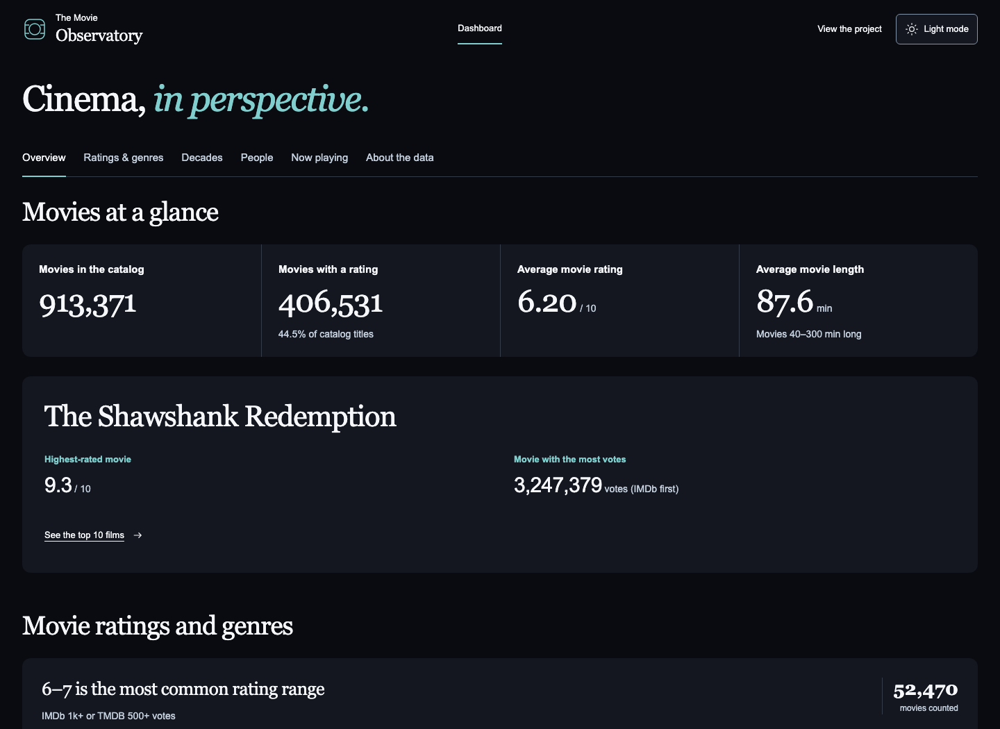
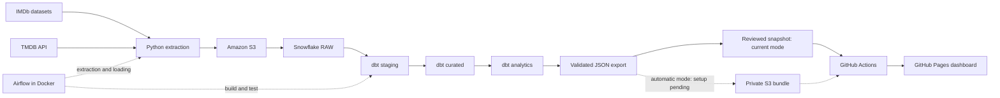

# Movie Analytics Pipeline & Dashboard

A data engineering project that combines IMDb datasets and TMDB now-playing data, transforms them in Snowflake with dbt, and presents the results in **The Movie Observatory**, a public movie analytics dashboard.

**Stack:** IMDb + TMDB API → Python + Airflow (Docker) → Amazon S3 → Snowflake → dbt → GitHub Actions → Web Dashboard (Plotly.js)

**Live Dashboard:** [ishuapurva1996.github.io/movie-analytics-pipeline](https://ishuapurva1996.github.io/movie-analytics-pipeline/)

The dashboard is live with the existing **October 5, 2026 data snapshot**. Data updates are manual for now. The weekly Airflow pipeline and automatic publication workflow are implemented; automatic publication still needs private integration setup and a verified complete ten-task run.

## Dashboard preview

[](https://ishuapurva1996.github.io/movie-analytics-pipeline/)

## Dashboard insights

Four overview KPIs summarize the catalog: **total movies, movies with a rating, average movie rating, and average movie length**. Movie highlights identify the highest-rated and most-voted titles.

The nine charts let visitors explore:

- **Rating distribution:** the share of qualifying movies in each rating range.
- **Average rating by genre:** how genre averages compare among movies meeting the vote threshold.
- **Average runtime by genre:** which genres have longer movies on average.
- **Top 10 films of all time:** the highest-rated qualifying films in this catalog.
- **Movies by decade:** the number of catalog movies meeting the length and year rules.
- **Average rating by decade:** how ratings compare across release decades.
- **Top 10 release years:** the years with the highest average movie ratings.
- **Top people by job role:** people ranked by the average ratings of their qualifying movie credits.
- **Now-playing recommendations:** up to five qualifying movies in the United States or India, ranked by rating.

### Interactive features

- **Light/dark toggle:** saves the selected theme and updates the charts with it.
- **Job-role selector:** switches the people ranking between directors, actors, writers, and other supported roles.
- **US/India selector:** changes the now-playing recommendations and market capture date.
- **Sized and colored dots:** show vote counts for top movies and qualifying film counts for top years and people. Legends and tooltips explain the scales.
- **Expandable data tables:** provide exact values and calculation rules beneath each chart.
- **Responsive layout:** supports desktop and mobile, with keyboard-accessible controls and source-date information.

Role and country selectors affect their own sections. The aggregated tables do not support accurate dashboard-wide genre or year filters.

## Architecture



### Pipeline components

| Component | What it does |
| --- | --- |
| **IMDb datasets** | Supply movie metadata, ratings, alternate titles, people, crew, and principal credits. |
| **TMDB API** | Supplies genres, US/India now-playing lists, and details for movies in the current extract. |
| **Python + Amazon S3** | Download source files, enrich TMDB movies, and store the landing files. |
| **Apache Airflow** | Coordinates ten tasks, scheduled every Monday at **6:00 AM America/Los_Angeles**, with manual runs available. |
| **Snowflake RAW** | Holds six IMDb and three TMDB source tables. |
| **dbt staging** | Normalizes source fields in nine views and excludes News-tagged titles before downstream analysis. |
| **dbt curated** | Builds seven tables for movies, genres, people, ratings, credits, and now playing. |
| **dbt analytics** | Builds twenty tables containing KPIs, genre summaries, distributions, and rankings. |
| **GitHub Actions + Pages** | Validate and publish the static dashboard with its public JSON snapshot. |

The browser reads exported analytics; it does not connect to Snowflake, AWS, or TMDB with private credentials.

## Project structure

```text
movie-analytics-pipeline/
├── .github/workflows/
│   ├── validate-dashboard.yml          # Python, DAG, and browser checks
│   ├── deploy-dashboard-snapshot.yml   # Current reviewed-snapshot publication
│   └── deploy-dashboard.yml            # Optional automatic Airflow/S3 publication
├── dags/
│   └── movie_pipeline.py               # Extraction, RAW refresh, dbt, and publication
├── scripts/                            # Ingestion, export, and site assembly
├── movie_dbt/
│   ├── models/
│   │   ├── staging/                    # IMDb and TMDB staging views
│   │   ├── curated/                    # Dimensions, facts, and bridge tables
│   │   └── marts/                      # Nine chart models and eleven KPI models
│   ├── macros/                         # Shared transformation rules
│   └── tests/                          # SQL data checks
├── airflow/                            # Dependencies and environment-based dbt profile
├── web_dashboard/
│   ├── redesign.html                   # Approved design; published as index.html
│   ├── index.html                      # Original implementation for source comparison
│   ├── css/                            # Dashboard layouts and themes
│   ├── js/                             # Plotly charts, filters, and theme controls
│   ├── assets/                         # Vendored Plotly and TMDB attribution logo
│   ├── snapshot/                       # Reviewed public JSON and its checksum
│   └── data-contract.schema.json       # Allowed public fields and validation rules
├── docs/
│   ├── assets/dashboard-preview.png    # README preview
│   ├── DASHBOARD_METRICS.md             # Populations, thresholds, and rankings
│   └── DASHBOARD_OPERATIONS.md          # Publication setup and recovery
├── tests/                              # Python and browser regression tests
├── Dockerfile
├── docker-compose.yaml
├── .env.example
├── requirements.txt
├── requirements-dashboard.txt
└── AIRFLOW_SETUP.md
```

## Setup

### Preview the dashboard locally

The checked-in public snapshot lets you preview the approved dashboard without warehouse credentials. From the project root:

```bash
python3 -m venv movie_proj_venv
source movie_proj_venv/bin/activate
pip install -r requirements-dashboard.txt
python scripts/build_dashboard_site.py --snapshot --state /tmp/movie-dashboard-selection.json
python -m http.server 8000 --directory _site
```

Open [localhost:8000](http://localhost:8000). Serve the dashboard over HTTP because its JavaScript fetches the JSON data. Site assembly publishes the approved design at `/`; `/redesign.html` remains an alias.

### Run the data pipeline

**Prerequisites:** Docker with Docker Compose, a TMDB API Read Access Token, AWS credentials and an S3 bucket, and a Snowflake account with the warehouse, `MOVIE_DB.RAW` tables, external stages, and source file formats already configured. The repository does not provision AWS or Snowflake infrastructure.

1. Copy [.env.example](.env.example) to `.env` and fill in the private settings. Keep credentials out of Git.
2. Configure AWS credentials. Docker mounts `~/.aws` read-only; environment variables are also supported.
3. Follow [AIRFLOW_SETUP.md](AIRFLOW_SETUP.md) to build the image, initialize Airflow, start its services, and verify the Snowflake connection.
4. Configure the export and automatic publication requirements in [dashboard operations](docs/DASHBOARD_OPERATIONS.md). A full ten-task run requires this private configuration even while the public site uses snapshot mode.
5. Open [Airflow at localhost:8080](http://localhost:8080), unpause `movie_analytics_pipeline`, and trigger a manual run. Confirm all ten tasks succeed and separately verify the GitHub deployment before calling automatic publication complete.

The DAG and dbt sources reference `MOVIE_DB.RAW`; check those definitions when adapting the database. The Compose setup includes local development login defaults documented in the setup guide.

## Dashboard deployment

### Current mode: reviewed snapshot

[Publish dashboard snapshot](https://github.com/ishuapurva1996/movie-analytics-pipeline/actions/workflows/deploy-dashboard-snapshot.yml) runs on relevant pushes to `main` or manual dispatch. It validates the checked-in JSON and SHA-256 checksum, assembles the approved frontend, uploads a Pages artifact, and verifies the public JSON after deployment.

GitHub Pages uses **GitHub Actions** as its source. To update the data, replace the real export and checksum together, validate the change, and publish it through `main`. Redeploying the frontend alone preserves the original warehouse, export, and capture dates.

### Optional mode: automatic publication after Airflow

```text
Successful ingestion and dbt build
  → Validate Airflow completion evidence and export public analytics
  → Write an immutable private S3 bundle and update the latest-success pointer
  → Request GitHub Actions deployment
  → Deploy current main with the latest validated bundle
  → Verify the public JSON checksum
```

This route requires the dedicated Airflow metadata reader, a repository-scoped dispatch token, and a read-only AWS OIDC role. After completing setup and verifying the full pipeline, set `DASHBOARD_PUBLICATION_MODE=airflow` in GitHub repository variables. This switches off snapshot publication and enables the automatic workflow.

A successful dispatch only confirms that GitHub accepted the request. The deployment run and public checksum check confirm publication. Predeployment failures preserve the last successful site. See [publication setup and failure recovery](docs/DASHBOARD_OPERATIONS.md).

## Key data notes

- **Catalog scope:** IMDb movie and TV-movie records plus current TMDB enrichment. Adult content is not excluded. Unknown genre classifications are retained.
- **News exclusion:** staging removes whole News-tagged titles, including titles with other genres and cross-source matches, before they reach downstream models.
- **Source preference:** ratings prefer IMDb when available, otherwise TMDB. Votes make that choice independently, so a rating and its displayed vote count can come from different providers.
- **Qualifying populations:** charts use different vote, runtime, and minimum-film rules. Genre ratings require 1,000+ votes on either source; runtime averages use movies 40–300 minutes long. The full catalog average is unweighted. A movie can contribute to more than one genre; IMDb and TMDB genre names are not harmonized.
- **Rankings:** top films need 100,000+ votes on either source. Lists use stable tie-breaking. Top release years are a ranking, not a complete time series. People ratings summarize qualifying principal-credit rows, not individual performance or a full filmography; repeated credits can weight a movie more than once.
- **Counts and distributions:** decade counts cover qualifying catalog movies, not worldwide production totals. The 2020s are incomplete. Rating-distribution percentages use the qualifying population, and the final 9–10 range includes exactly 10.
- **TMDB coverage:** details enrich the distinct titles in the current US/India now-playing extract; historical TMDB backfill is not implemented. These are exhibition markets, not production countries, and a movie can appear in both.
- **Refresh behavior:** all nine RAW tables use full replacement. Each table loads through a temporary table and a transaction; an empty load preserves the target and an insert failure rolls back its replacement. Transactions are per table. dbt rebuilds 27 tables and recreates nine staging views with `dbt build --full-refresh`.
- **Missing values and freshness:** unknown values display as unavailable. Warehouse completion, export time, and TMDB capture dates have different meanings; IMDb capture time is unavailable. An eight-day warning identifies stale data. Previous now-playing snapshots are not retained.
- **Current limits:** financial and country-comparison analytics are not implemented, although budget, revenue, and country fields are extracted. The local Airflow schedule runs only while its host and Docker services are available.

Exact thresholds, ranking rules, and public fields are documented in [dashboard metrics](docs/DASHBOARD_METRICS.md).

<details>
<summary>Pipeline retry and validation details</summary>

TMDB movie-details requests have a 30-second timeout and retry temporary failures up to three attempts. If a movie still fails, enrichment raises an error before writing its output CSV. Airflow retries the task once after five minutes. TMDB upload, loading, and dbt wait for enrichment to succeed; the independent IMDb branch can still run.

The public export contains only allowlisted aggregate metrics and ranked rows. Synthetic fixtures are used for tests and are never published as production data. Automatic publication requires execution-backed dbt completion evidence and consistent Airflow history; manually marking a failed build successful cannot make it eligible. Conditional pointer updates and predeployment input checks protect against competing or outdated publications.

</details>

## Tests

The regression suite covers extraction and enrichment, DAG wiring and Snowflake refreshes, public data validation, export eligibility, site assembly, and browser behavior. Browser checks cover chart values, desktop/mobile layout, keyboard controls, filters, themes, freshness, and empty/error states. The deployed site was verified on desktop and mobile on October 7, 2026.

```bash
source movie_proj_venv/bin/activate
pip install -r requirements.txt
pip install -r requirements-dashboard.txt
python -m unittest discover -s tests -p 'test_pipeline_scripts.py' -v
python -m unittest discover -s tests -p 'test_dashboard_*.py' -v
```

Run the Airflow tests inside a running scheduler container. The test file is supplied through standard input because `tests/` is not mounted into the container:

```bash
docker compose exec -T -e PYTHONPATH=/opt/airflow/dags airflow-scheduler python - < tests/test_airflow_dag.py
```

[GitHub validation](.github/workflows/validate-dashboard.yml) runs the Python and browser checks. dbt data tests run against Snowflake during `dbt_build`; see [the model definitions](movie_dbt/models/). Mocked tests do not replace a full run against the configured infrastructure.

## Data sources and attribution

- **IMDb:** [Non-commercial datasets](https://developer.imdb.com/non-commercial-datasets/) and the [dataset download directory](https://datasets.imdbws.com/).
- **TMDB:** [The Movie Database](https://www.themoviedb.org/) supplies genres, now-playing lists, and movie details. See its [API and attribution guidance](https://developer.themoviedb.org/docs/faq).

This product uses the TMDB API but is not endorsed or certified by TMDB.

Source data remains subject to the providers' terms. The owner confirmed permission covering this dashboard's public aggregates and ranked rows on October 2, 2026. See [IMDb's usage conditions](https://help.imdb.com/article/imdb/general-information/can-i-use-imdb-data-in-my-software/G5JTRESSHJBBHTGX) before adapting the public output to other uses. Preserve TMDB's approved logo and notice. This repository does not grant rights to redistribute either provider's datasets or images.
