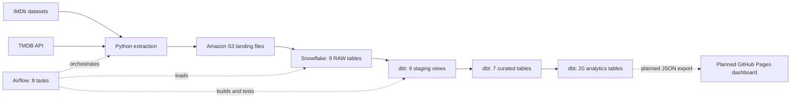

# Movie Analytics Pipeline

A movie data pipeline that combines IMDb datasets with TMDB now-playing information for the United States and India. Python extracts the source data, Amazon S3 stores the landing files, Snowflake holds the warehouse, and dbt builds the tables used for analysis. Apache Airflow schedules and coordinates the work.

**Current status:** the ingestion, warehouse refresh, and dbt models are implemented. A public dashboard is planned; this repository does not yet contain a live dashboard.

## What the pipeline supports

- Movie counts, ratings, runtimes, and genre summaries.
- Analyses by release year and decade, rating distributions, and ranked movies and people.
- Current now-playing counts and movie recommendations for the US and India.
- Weekly refreshes every Monday at **6:00 AM America/Los_Angeles**, with manual runs available in Airflow.
- Full replacement of all nine Snowflake RAW tables, followed by a full dbt rebuild.

TMDB details are fetched for the distinct movies in the current now-playing extract. They supplement the broader IMDb catalog; they are not a complete historical TMDB catalog.

## Architecture



The RAW layer holds six IMDb datasets and three TMDB datasets. Staging views normalize source fields. Curated tables join movie, genre, person, rating, and now-playing data. Analytics tables provide the final summaries and rankings.

The planned dashboard will read exported JSON files. Visitors will not need direct access to Snowflake, AWS, or TMDB credentials.

## Refresh and failure behavior

Each RAW load first copies data into a temporary Snowflake table. After checking that the load is nonempty, the pipeline replaces that target table's rows in a transaction. An empty load leaves the target unchanged, and a failed insert rolls back its replacement. These transactions apply **per table**, not to the entire pipeline at once.

All tables use full refreshes, including `TMDB_NOW_PLAYING`. Its `SNAPSHOT_DATE` describes the incoming extract; previous snapshots are not retained. The dbt task runs `dbt build --full-refresh`, rebuilding 27 tables and recreating nine staging views.

TMDB movie-details requests have a 30-second timeout and retry temporary failures up to three attempts. If any movie still fails, enrichment raises an error before writing its output CSV. Airflow retries the task once after five minutes. The TMDB upload, TMDB load, and dbt build wait for enrichment to succeed; the independent IMDb branch can still run.

## Run locally

Prerequisites:

- Docker with Docker Compose.
- A TMDB API Read Access Token.
- AWS credentials and an S3 bucket for the landing files.
- A Snowflake account with a warehouse, `MOVIE_DB.RAW` target tables, external stages, and file formats already configured for the source files.

The repository does **not** provision the AWS or Snowflake infrastructure. The DAG and dbt sources currently reference `MOVIE_DB.RAW`; check those definitions when adapting the project to a different database.

1. Copy [.env.example](.env.example) to `.env` and fill in your local settings.
2. Configure AWS credentials. Docker mounts `~/.aws` read-only; environment variables are also supported.
3. Follow [AIRFLOW_SETUP.md](AIRFLOW_SETUP.md) to build the image, initialize Airflow, start the services, and verify the Snowflake connection.
4. Open [local Airflow](http://localhost:8080), unpause `movie_analytics_pipeline`, and trigger a manual run.
5. Check that all eight tasks succeed and review the dbt test results before using the resulting data.

The Compose configuration is for local development. It includes local Airflow login defaults documented in the setup guide.

## Tests

The Python regression suite contains **18 tests**: ten for extraction/enrichment behavior and eight for the DAG and Snowflake refresh logic. These use mocked external services; passing them does not replace a complete Airflow run against your own infrastructure.

For the ten script tests, install the local dependencies in a virtual environment:

```bash
python3 -m venv movie_proj_venv
source movie_proj_venv/bin/activate
pip install -r requirements.txt
python -m unittest discover -s tests -p 'test_pipeline_scripts.py' -v
```

Run the eight Airflow tests inside a running scheduler container. The test file is supplied through standard input because `tests/` is not mounted into the container:

```bash
docker compose exec -T -e PYTHONPATH=/opt/airflow/dags airflow-scheduler python - < tests/test_airflow_dag.py
```

The dbt project also defines data tests that run against Snowflake as part of the `dbt_build` task. See [the model definitions](movie_dbt/models/) for the transformations and associated checks.

## Repository layout

| Path | Purpose |
| --- | --- |
| [dags/movie_pipeline.py](dags/movie_pipeline.py) | Airflow dependencies, RAW refreshes, and dbt execution |
| [scripts/](scripts/) | IMDb downloads, TMDB extraction/enrichment, and S3 uploads |
| [movie_dbt/models/](movie_dbt/models/) | Staging, curated, and analytics SQL models |
| [airflow/](airflow/) | Airflow dependencies and environment-based dbt profile |
| [Dockerfile](Dockerfile), [docker-compose.yaml](docker-compose.yaml) | Local Airflow and PostgreSQL services |
| [tests/](tests/) | Python regression tests |
| [.env.example](.env.example) | Configuration template without real credentials |
| [AIRFLOW_SETUP.md](AIRFLOW_SETUP.md) | Setup, operational checks, and refresh details |

Credentials belong in `.env`, AWS credential storage, or the environment. `.gitignore` excludes local secrets, downloaded data, logs, virtual environments, and generated dbt artifacts. Keep those files out of commits and public dashboard assets.

## Dashboard roadmap and current limits

The next milestone is a GitHub Pages dashboard that updates after each successful Airflow data refresh. A validated JSON export will keep the public site available with the last successful data if a later run fails.

Current limits:

- Historical TMDB backfill is not implemented.
- Full refreshes do not preserve previous now-playing snapshots for comparisons over time.
- Budget, revenue, and country fields are extracted, but the broader financial and country comparison analytics from the original project scope are not implemented.
- Airflow currently runs locally. Its scheduled pipeline only runs while the Docker services and host are available.

## Data sources and attribution

- **IMDb:** [IMDb non-commercial datasets](https://developer.imdb.com/non-commercial-datasets/) and the [dataset download directory](https://datasets.imdbws.com/).
- **The Movie Database (TMDB):** [TMDB](https://www.themoviedb.org/) supplies genres, now-playing lists, and movie details through its API. See its [API and attribution guidance](https://developer.themoviedb.org/docs/faq).

This product uses the TMDB API but is not endorsed or certified by TMDB.

Source data remains subject to the providers' terms. This repository does not grant rights to redistribute their datasets or images.
